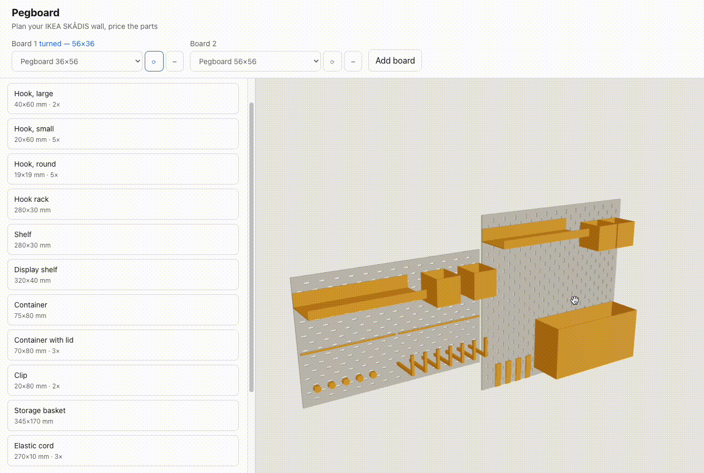
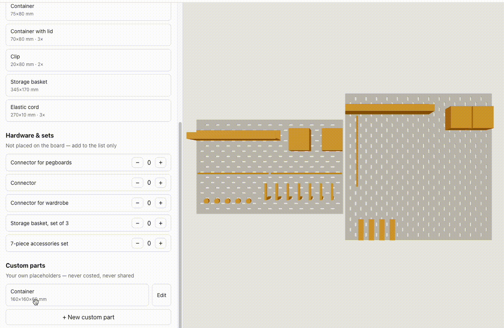
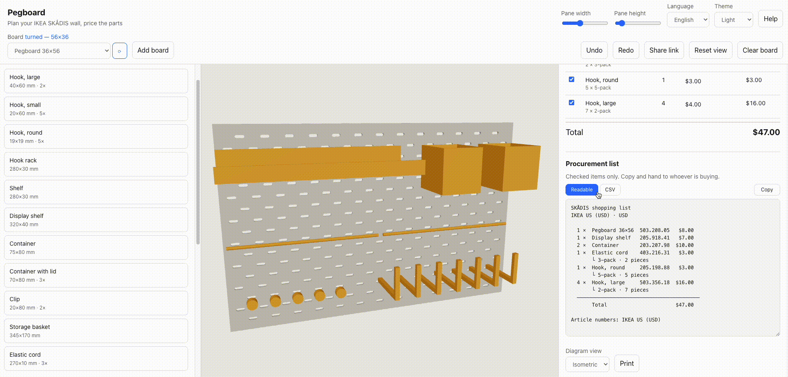

<div align="center">

# Pegboard

Plan an IKEA SKÅDIS pegboard wall in 3D, drop accessories onto the real peg holes, and price only the partss you still need to buy. Fully static — no backend, no API key, no build-time secrets.

[](https://github.com/mofane-work/pegboard/actions/workflows/ci.yml)
[](./LICENSE)
[](https://counter.dev)

</div>

### ▶ [Try it live](https://mofane-work.github.io/pegboard/)

No install, no sign-up — it is a static page.

> **Unofficial.** Not affiliated with, endorsed by, or sponsored by Inter IKEA Systems B.V.
> SKÅDIS and IKEA are trademarks of their respective owners. Prices are indicative, come
> from a public IKEA endpoint, and may be stale or wrong — **always confirm price and
> availability on ikea.com before buying.**



## Contents

- [Why this exists](#why-this-exists)
- [Project status](#project-status)
- [Features](#features)
- [Features](#features)
- [Quick start](#quick-start)
- [Commands](#commands)
- [How it works](#how-it-works)
- [The hard parts](#the-hard-parts)
- [Limitations](#limitations)
- [Project structure](#project-structure)
- [Deployment](#deployment)
- [Visit counting](#visit-counting)
- [Contributing](#contributing)
- [License](#license)

---

## Why this exists

> I was standing in an IKEA store trying to mentally arrange pegboard accessories when I realized a 3D planner would make the process much easier. This is why I build this so you don't have to.

Planning a pegboard wall in the store, or in your head, goes badly in three specific ways:

1. **You can't see it.** SKÅDIS accessories only mount on a fixed 40 mm lattice of slots. Whether the shelf you want actually fits next to the hook you already have is a geometry question, and the answer is not obvious from a product photo.
2. **You over-order.** Several SKUs are multipacks. Six hooks is not "six × the hook
   price" — it's three 2-packs. Per-unit mental arithmetic silently under-orders, and you find out at the checkout.
3. **You price the wrong thing.** If you already own half the parts, the number you
   actually care about is the cost of the *upgrade*, not the cost of the wall. No store page will tell you that.

So: a 3D view at true millimetre scale, snapping that respects the real hole pattern, and a cost table where **every line has a checkbox** so you can exclude what you already own.

## Project Status: Feature Complete

This project was built to solve a design problem for Pegboards and offered some additional features alongside the plan. I consider it feature-complete and open-sourced it so others can leverage the work without reinventing the wheel. 

- **Bugs:** I will review and attempt to fix reported bugs. 
- **Features:** I do not plan to add new features. If you have an exceptionally compelling use-case, open an issue to discuss it, but unsolicited feature pull requests will generally not be merged.
- **Forks:** You are highly encouraged to fork this repository and modify the existing code to build whatever custom features you need.

## Features

**Modelling**
- 3D board view at true scale, procedurally generated — no third-party meshes.
- **Multi-board walls**: up to 3 boards side by side, dragged and priced as one wall.
- 4 boards and 16 accessories from the official SKÅDIS range (11 of them placeable).

- **Parity-aware snapping.** SKÅDIS slots form two interleaved lattices; an accessory with pegs on 40 mm centres can only sit on one of them. The snapper filters by lattice and rejects overlaps instead of letting parts intersect.
- **Board orientation** — hang any wall board the other way round with ⟳ in the top bar. A 36×56 board becomes 56×36, and the peg lattice turns with the panel rather than being regenerated for the new dimensions.
- Quarter-turn rotation, undo/redo (50 steps), keyboard shortcuts.
- **User-defined custom parts** — placeholder blocks for the 3D-printed holder or the router that isn't an IKEA product. Sized in whole peg cells, purely a visualisation aid.


**Pricing**
- **Prices for US, GB, DE, FR and JP**, plus a **Custom** market where you enter your own
  prices in your own currency.
- **No third-party request when you open the page.** Prices are read from a snapshot built
  into the bundle and kept current by a weekly GitHub Action. Press **Refresh prices** if
  you want today's number instead — that is the only thing here that ever contacts IKEA.
- **Per-line checkboxes** so you can price only the upgrade.
- **Per-line price overrides**, persisted — covers second-hand parts, sale prices, and any market with no live source.
- **Pack-quantity aware**: `ceil(qty / packQty) × packPrice`, and the table shows both numbers when they differ ("6 hooks → 3 × 2-pack").
- Graceful degradation: override → live → cache → bundled snapshot → "—". An unknown
  price is never counted as zero.


**Output**
- **Shopping list** with IKEA article numbers in the dotted form store staff look up.
- **Printable build sheet** with an orthographic or isometric diagram of the finished wall.

- **Share links** — the whole configuration is encoded in the URL, no server involved.

**Interface**
- **English, Japanese, Traditional Chinese** (en / ja / zh-Hant).
- Light / dark / system theme, applied to the 3D scene as well as the page.
- **Resizable board pane** — width and height, both from the top bar.
- Configuration autosaves to localStorage.
- **No analytics, no cookies, no accounts.** There is no server; nothing you do here is
  sent anywhere. See the Privacy section in the app's Help panel.

## Quick start

Requires **Node 20.19+ or 22.12+** (Vite 7's floor; CI runs Node 24).

```bash
npm install
npm run dev
```

The dev server listens on **port 3001** and binds all network interfaces, so you can open
it from a phone or tablet on the same network to check the layout on a touchscreen.

```bash
npm run build     # production build to dist/
npm run preview   # serve that build locally
```

## Commands

| Command | Purpose |
|---|---|
| `npm run dev` | Dev server (port 3001, all interfaces). |
| `npm run build` | Type-check (`tsc -b`) then build to `dist/`. |
| `npm run preview` | Serve the production build locally. |
| `npm test` | Run the suite once (`vitest run`). |
| `npm run test:watch` | Tests in watch mode. |
| `npm run lint` | ESLint. |
| `npm run typecheck` | `tsc --noEmit`. |
| `npm run verify-api` | Canary: assert IKEA's undocumented endpoint still returns the fields we depend on. |
| `npm run refresh-prices` | Refresh `src/data/price-snapshot.json` from live data. Refuses to shrink a market's price list, and leaves the file alone when nothing changed. |

## How it works

**Stack** — Vite + React 19 + TypeScript, `@react-three/fiber`/`drei` for 3D, `zustand` for state, `react-i18next` for translation. Three global stylesheets with BEM classes and CSS custom properties; no CSS framework. Three.js world units are millimetres.

**The catalog** (`src/data/catalog.ts`) is the source of truth. Items are keyed by a stable internal slug and carry a **per-market map of item numbers**, because IKEA numbers the same product differently in each market (the white 76×56 board is `10321618` in the US and `90321619` in Japan). Every dimension is traceable to a published IKEA measurement; anything estimated is flagged in the data itself (`patternEstimated`, `dimsVerified`, `latticeVerified`) rather than quietly assumed.

**Pricing** (`src/lib/pricing.ts`) resolves each line through a chain, first hit wins, and nothing in it may throw:

1. **User override** (localStorage) — always wins, badged "your price".
2. **Live fetch** — one call per market, matched by `itemNos[market]`. Only ever on an
   explicit **Refresh prices**; nothing fetches on load.
3. **Session cache** (24 h TTL), populated by that refresh.
4. **Bundled snapshot** — the normal source, shown with its capture date.
5. **Unknown** — rendered "—", excluded from the total, and called out separately.
The snapshot is regenerated by `.github/workflows/refresh-prices.yml` (weekly, plus manual
dispatch), which commits `src/data/price-snapshot.json` only when something actually
changed and thereby triggers a deploy. It **refuses to write a price list shorter than the
one on disk**: a throttled or partial response from an undocumented endpoint would
otherwise replace good prices with none, for every visitor, unattended.

**Interaction** — pointer events, not HTML5 drag-and-drop (which is unreliable over a
canvas and dead on touch). `pointerdown` on a palette item spawns a ghost, the board plane
is raycast on move, the nearest *valid* hole is previewed live, and `pointerup` commits.
Overlap turns the preview red and refuses the drop.

## Limitations

Known and deliberate — see `findings.md` F15.

- **The bundle is ~1.22 MB (≈348 kB gzipped)**, dominated by three.js. Fine for a desktop planning tool on a static host; noticeable on mobile data. Code-splitting the 3D view is the fix if it becomes a problem.
- **Peg spacing on accessories is estimated.** IKEA publishes product dimensions but not peg spacing, so each pattern is an engineering estimate from the product width against the 40 mm pitch. Items are flagged `patternEstimated` in the catalog.
- **The free-standing board's lattice is unverified** — its published height includes the stand, so the slot field may not be centred. Flagged `latticeVerified: false`.
- **Changing board size or orientation clears that board.** Hole ids are board-relative, so placements can't be carried across without re-solving every position. Silently moving someone's layout is worse than clearing it, so this stays explicit. Both are undoable.
- **A turned board has sideways slots, and real SKÅDIS accessories don't hang in those.**
  Slots are 5 × 15 mm *vertical* obrounds and every accessory hooks in from above; turn the panel and they become 15 × 5 mm horizontal ones, with no downward travel for a peg to drop into. That is reasoning from the slot geometry rather than something probed against a real board, so the app draws the turned slots honestly and notes it in Help instead of blocking the feature. The free-standing 56×37 board can't be turned at all — it sits on a stand. (F24)
- **Prices are a snapshot, not a live quote.** The page fetches nothing on load, so what
  you see is as fresh as the last workflow run — up to a week old, and the capture date is
  shown. Press **Refresh prices** for today's. Either way they are indicative: check
  ikea.com before buying.
- **Prices depend on an undocumented endpoint.** It's CORS-open and needs no key, but it's
  not a public API and it's a ToS grey area. It can change or disappear at any time; when
  it does, the snapshot keeps working and simply stops being updated. `verify-api` runs
  weekly in CI as the early warning.
- **No live prices for Traditional Chinese markets** (Taiwan / Hong Kong / Macau) — use the Custom market with overrides.
- **Custom parts are never costed and never shared.** They have no article number and no price; the cost table shows a footnote instead. They do appear on the print diagram.
- **Wall size caps at 3 boards; custom parts cap at 12.** Both limits are enforced in the store, not just the UI.
- **Only white boards are modelled.**
- **Not a structural or load calculator.** It tells you what fits, not what will hold.

## Project structure

```
src/
  data/
    catalog.ts            # curated SKÅDIS catalog — source of truth
    customParts.ts        # user placeholders → synthetic AccessoryItem
    price-snapshot.json   # the prices the app ships with + capture date
    support.ts            # optional "buy me a coffee" link (plain URL, no widget)
  lib/
    grid.ts               # hole lattice, snapping, occupancy
    wall.ts               # multi-board wall layout
    geometry/             # one procedural builder per archetype
    pricing.ts            # resolution chain + pack-aware cost model
    shareLink.ts          # URL encode/decode of a configuration
    shoppingList.ts       # article numbers, pack maths
    priceSnapshot.ts      # snapshot merge + the no-shrink guard
    marketPrices.ts       # the on-request live fetch, and its cache
    boot.ts               # dismisses the pre-React splash in index.html
    printProjection.ts    # orthographic / isometric build-sheet diagram
  state/
    store.ts              # zustand: config, market, language, overrides
    drag.ts               # transient drag state, not persisted
  components/             # Scene, Board, AccessoryMesh, Palette, CostTable,
                          #   Toolbar, Help, CustomPartForm, ShoppingList, PrintSheet
  i18n/                   # en.json, ja.json, zh-Hant.json
scripts/
  refresh-prices.ts       # regenerate the price snapshot
  verify-api.ts           # contract check against the live endpoint
data-raw/                 # raw scraped product measurements + the fetch script
```

## Built with AI

This project was developed with the assistance of [Claude Code](https://claude.ai). AI was used to accelerate development, help structure the 3D rendering logic, and generate boilerplate, while the core architecture, product design, and final code reviews were human-directed.

## Visit counting

This is the **one** third-party request the app makes.

### What runs, and when

`src/lib/analytics.ts` injects [counter.dev](https://counter.dev)'s 1.1 kB tracker on
mount, and only if **both** gates pass:

1. a site token is configured (`VITE_COUNTER_DEV_ID`, or `CONFIGURED_ID` in that file), and
2. the visitor has not opted out.

An unconfigured build — every local build, every fork — injects nothing and makes no
request, and the Help panel shows the original "no analytics, no cookies" wording instead.
The two privacy texts (`help.pv1` / `help.pv1off`) exist so the promise on screen always
matches what the build actually does.

counter.dev receives one POST per first page view: country (derived from IP by their CDN),
referrer, screen size, browser language. No cookies, no fingerprint, no per-page tracking.
**Nothing about the wall is ever sent** — placements, prices and overrides stay in
localStorage, as they always have.

### The opt-out is load-bearing

Counting uniques uses `sessionStorage` plus the browser cache, which is terminal-equipment
access under ePrivacy Art 5(3) — "cookieless" is not the same as "outside the cookie rule",
and counter.dev's own FAQ declines to claim otherwise. The Help panel's **Count my visit**
checkbox is what the UK's statistical-purposes exemption (PECR, as amended by the DUAA
2025) and CNIL's audience-measurement exemption both require: a simple, free way to object.
It writes `pegboard.analytics-opt-out` to localStorage — deliberately **not** a store field,
so no migration, share link or `applyShared` can reset someone's privacy choice — and takes
effect from the next page load, which the UI says rather than implying an undo that
doesn't exist.

If you fork this and don't want any of it, do nothing: unconfigured is the default.

### The README badge

counter.dev publishes no badge and no unauthenticated count endpoint — reading a count
needs the dashboard share token, and a token in a README URL is a published token. So
`.github/workflows/refresh-visit-count.yml` runs daily, `scripts/refresh-visit-count.ts`
reads the count server-side over counter.dev's SSE `/dump` endpoint, and only the number
is committed to `.github/badges/visits.json`, which shields.io renders. It refuses to write
a count lower than the one on disk — visits are cumulative, so a smaller number means a
partial response, and a public badge counting backwards is worse than one a week stale.
`deploy-pages.yml` ignores that path, so the daily commit doesn't redeploy the site.

### Setup (placeholders until you do this)

| Where | Name | Where the value comes from |
|---|---|---|
| Settings → Secrets and variables → Actions → **Variables** | `COUNTER_DEV_ID` | the `data-id` in the snippet counter.dev shows you. It is a UUID alias for your account, not your username — ends up in the public bundle, so a variable, not a secret |
| … → **Variables** *(optional)* | `COUNTER_DEV_SITE` | which site to count, if the account tracks more than one. Omit to sum them all; the script logs the keys it found |
| … → **Secrets** | `COUNTER_DEV_USER` | your counter.dev **username** — the one you log in with, not the `data-id` |
| … → **Secrets** | `COUNTER_DEV_TOKEN` | **does not exist until you create it.** On the dashboard, find the eye icon reading "This account has no guest access" and click **Share**. It becomes "Copy url", giving `…?user=<USERNAME>&token=<TOKEN>` — the two values above |

That share URL grants read access to the **whole dashboard** to anyone holding it, which
is exactly why the token is a secret and why the badge is generated by a workflow rather
than fetched from the README. "Remove" on that same row revokes it, invalidating any share
link you have handed out.

One account has one `data-id`; counter.dev separates sites by the `Origin` header, so
a GitHub Pages project site reports as `<user>.github.io` and shares that bucket with
anything else you host there.

If you fork this, put your own owner/repo in the badge URL at the top, and check the
branch in it matches your default branch (this repo's is `main`).

Local preview without editing source:

```bash
VITE_COUNTER_DEV_ID=<token> npm run dev     # will send real hits — use a throwaway site
COUNTER_DEV_USER=… COUNTER_DEV_TOKEN=… npm run refresh-visit-count
```

## Contributing

See [CONTRIBUTING.md](./CONTRIBUTING.md) for setup, house rules, and where things live.
Participation is covered by the [Code of Conduct](./CODE_OF_CONDUCT.md).

Before opening a PR:

```bash
npm run typecheck && npm run lint && npm test && npm run build
```

The rules that matter more than style:

- **Discuss features first.** Because the project is considered feature-complete, please open an issue to discuss any new feature before writing code. Unsolicited feature PRs will likely be closed.
- **Every catalog dimension needs a real source.** If a dimension is a guess, mark it
  `// UNVERIFIED` and record it in `findings.md`. The catalog's credibility is the whole
  project.
- **Never bundle IKEA assets** — no meshes, no product images, no copyrighted data. All
  geometry is authored procedurally.
- **Nothing fetches on page load.** If a change adds a request that fires on mount, raise it
  as an issue first.
- **Bump the persist version** when the saved shape changes, and cover the migration in
  `src/state/store.test.ts`.

## License

[MIT](./LICENSE) — © 2026 Mofane.

The MIT license covers this project's own code. It does not extend to IKEA's trademarks,
product data, or imagery.
